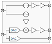

# Amateur Satellite Transceiver IC - Shuttle 2

This step in the development and prototyping of the Amateur Radio Satellite Transceiver project contains:

 - 150 MSPS differential current steering DAC with dynamic element matching
 - 8 GHz differential Colpitts topology VCO
 - Baseband to IF mixer
 - High-speed buffer amplifier
 - RF IO driver which can be combined with an off-chip distributed balun to drive off chip loads

The combination of the above items forms a digital input, 8 GHz RF output transmitter prototype.
Note that there is no filtering included at this point, therefore this cannot be seen as a complete transmitter. 
It is an experimental evaulation of the building blocks.

This is a shuttle prototype run of the larger project which can be found here: [github.com/yrrapt/amsat_txrx_ic](https://github.com/yrrapt/amsat_txrx_ic)